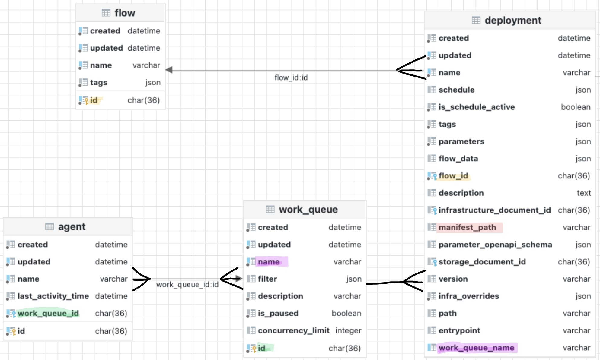
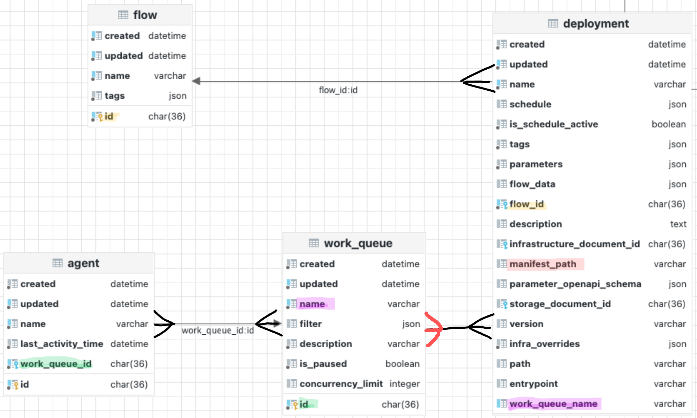

# Template for Prefect deployments with CI/CD and one-click agent deployment

The goal of this recipe is to have one Prefect agent (running on AWS ECS Fargate) with shared core package dependencies per project. This means that:

- the pip packages such as pandas, numpy, scikit learn etc. are baked into an ECR image and this image gets used to deploy an agent process
- the flow deployments can have custom module dependencies which are packaged alongside flow code to S3
- the flow deployments are created automatically from CI/CD but they can also be created from your local machine and this will work the same way


Make sure to adjust your AWS account ID and your default region in the ``task-definition.json`` file.


# How does `prefect deployment build` CLI work and how you can customize it

- We assume that an agent is spun up with a work queue name `prod` in all the examples below; the redesigned work queues transform the relationship between your deployment and the work-queue this deployment is designated for into a 1:1 mapping - any given deployment can have only one work queue name assigned e.g. `-q prod` and creating an agent with `prefect agent start -q prod` makes it easy to understand which agent polls from which work queues, and work queue will pick up which runs
- There are several CLI shortcuts, but you can always use the equivalent full identifiers:
    - `-n` stands for `--name` - the name to give this deployment
    - `-t` stands for `--tag` - one or more optional tags to apply to the deployment to organize your deployments and flow runs based on your projects.
    - `-v` stands for `--version` - version of this deployment; you could implement custom versioning or (recommended) use the Git commit SHA set from your CI/CD
    - `-o` stands for `--output` - the optional location for the YAML manifest
    - **Infrastructure concerns**
        - if you don’t provide any infrastructure configuration, Prefect will assume that you want to run it as a local process
        - `-infra` stands for `--infrastructure` - the optional flag to specify the infrastructure type - this is helpful to get started, because this way Prefect will create the infrastructure block for you; you may use it to generate a default infrastructure scaffold in YAML and manually override the values in YAML if needed; for more customized setup and for production workloads, we recommend using `-ib`, i.e. infrastructure blocks with optional per-deployment `--override` arguments.
        - `-ib` stands for `--infrastructure-block` - name of an already created infrastructure block in the format: `block_type/block_name`
            - `-ib proces/prod` - for a `Process` block with name `prod`
            - `-ib docker-container/prod` - for a `DockerContainer` block with name `prod`
            - `-ib kubernetes-job/prod` - for a `KubernetesJob` block with name `prod`
            - Note: infrastructure blocks are powerful since they allow you to have a parent infrastructure block defining generic structure you want to follow for most deployments. This prevents boilerplate code and allows you to reuse the same generic configuration, and makes your DevOps process easy to change (e.g. changing a Kubernetes namespace or the default image), you can do all that from a single place. If some deployments require slight deviation from the standard infrastructure configuration (e.g. a different docker image with custom package dependencies) you can override those from CLI without having to modify your code.
        - `--override` - a flag for infrastructure overrides → you can pass it multiple times to each deployment build command to override multiple arguments; examples:
            - `--override env.PREFECT_LOGGING_LEVEL=DEBUG` will override or add the environment variable to set log level to `DEBUG`
            - `--override image=prefecthq/prefect:2-python3.9` will override the Docker image set on the block to this specific image (*this is the image using the latest Prefect 2.0 version and Python 3.9*)
    - **Storage concerns**
        - if you don’t provide any storage block configuration, Prefect will assume that [the files are in the computer](https://www.youtube.com/watch?v=L_o_O7v1ews), i.e. that the flow code and related module dependencies exist on the local machine from which you create and run your deployment
        - `-sb` stands for `--storage-block` - name of an already created infrastructure block in the format: `block_type/block_name`
            - `-sb s3/prod` - for an `S3` block with name `prod`
            - `-sb gcs/prod` - for a `GCS` block with name `prod`
            - `-sb azure/prod` - for an `Azure` block with name `prod`
    - `--cron` - a CRON string that will be used to set a `CronSchedule` on the deployment, e.g. `--cron "*/1 * * * *"` to schedule flow runs from that deployment every minute.
    - `--interval` - an integer specifying an interval (in seconds) that will be used to set an IntervalSchedule on the deployment, e.g. `--interval 60` to schedule flow runs from that deployment every minute.
    - `--rrule` - a string with an rrule allowing you to set highly customized schedules on your deployment, e.g. `--rrule 'FREQ=HOURLY;BYDAY=MO,TU,WE,TH,FR;BYHOUR=9,10,11,12,13,14,15,16,17'` to schedule flow runs from that deployment every hour but only during business hours.
    - `-a` stands for `--apply` - allows you to directly apply the manifest, effectively creating deployment with a single command, while still retaining the YAML manifest that you can use as a build artifact.

# What does `prefect deployment apply` do

If you haven’t applied the deployment already during build, you can use the YAML file generated as part of the build step and leverage the command below to send the newly created or updated deployment information to the API backend.

```bash
prefect deployment apply your.yaml 
```

## Do I need to keep and version-control the YAML file?

Storing the YAML file in your project repository with flows is entirely optional. If you want to, you can version-control those YAML files as a scaffold of deployment information for each flow.

One common use case we anticipate is using the YAML files as build artifacts of the CI/CD process, and relying purely on blocks and CLI as a way to continuously send deployment metadata to the Prefect backend.

# Work queues, agents and deployments relationship: before (left) and now (right)


Note that both images mark `manifest_path` as red, since this argument is no longer used and it’s maintained only for backward compatibility with Prefect ≤ 2.0.3.


# Relationship between work queues, agents and deployments

The major difference is that a deployment can now be assigned a single `--work-queue` name and be picked up by a single work queue, avoiding overlap and surprises.

If you used the approach of having a **single agent** polling from a **single work queue**, and a **deployment with a single tag** corresponding to an active work queue, nothing changes other than the syntax of the deployment build process: renaming the `-t prod` to `-q prod`, and instead of starting the agent with `prefect agent start -t prod`, you now would do it using `prefect agent start -q prod`.

However, if you leveraged **multiple agents** polling from **multiple queues**, and deployments with **multiple tags** corresponding to active queues, the setup improved significantly. Assuming a deployment with tags `k8s`, `prod` and `myproject`, the flow runs from that deployment could have been picked up by any work queue with matching tag at random, leading to potential confusion since you could never be sure which queue would pick up that run. Given that now deployment accepts only one queue name (*and you can still have as many tags as you want for organization!*), you can always be sure which work queue will pick up a flow run from that deployment. Even though many agents can simultaneously poll from the same queue, the run will only be executed once due to idempotency key assigned to the run.

The change also helps with incremental adoption - users don't have to learn about work queues unless they need it for more advanced use cases such as concurrency limits, pausing work, etc.

## Current relationships


## Legacy: work-queues with many-to-many mapping to deployments via ``tags``




# FAQ

- What are use cases where assigning **multiple work queues** to a **single agent** can be beneficial?
    - gating work to a single agent

    ```python
    prefect work-queue create prio1 --limit 20
    prefect work-queue create prio2 --limit 5
    prefect agent start -q prio1 -q prio2
    ```

  In this example, the agent can simultaneously poll for work from both of those queues, but given that work prio1 is considered more important, it has higher concurrency setting than prio2 work queue. In short, runs from deployments with prio1 work queue are prioritized over runs from deployments with prio2 work queue within a single agent process.

- What are use cases where starting **multiple agent** processes for the **same work queue** can be beneficial?
    - If users don’t use a cluster such as Kubernetes and need to spread the load, they can run e.g. multiple EC2 instances, each running an agent process polling from the same work queue.
    - While we don’t guarantee that we would equally load balance the runs (the runs are picked up at random by the agents with matching work queue names), each run will be picked up from the work queue only once — we use idempotency keys to avoid duplicate work and prevent situations where s single run could be simultaneously picked up by two agents polling from the same work queue.

- Can I specify deployments using **Python** code rather than CLI?

  Yes, that’s possible. There are some limitations of that approach such as e.g.:

    - it’s more difficult to integrate that with CI/CD - you can’t easily pass your Git commit via CLI (unless you add some argparse etc. on top and effectively transform this Python process into a CLI process for invocation)
    - you have to write and maintain extra code which could be avoided when using CLI
    - it may not be immediately clear which files get packaged alongside your flow code (think of import paths) depending on directory from which you execute that Python script; in CLI approach, you specify the path explicitly or as an absolute path in relation to the root directory - to explain this distinction more clearly:
        - the CLI separates between `path` (your root project directory), and the `entrypoint` (e.g. `flow.py:flow_func`), while the Python UX combines this information within the `entrypoint` and keeps the `path` argument as None
        - many parts of the Deployment object that need to be sent to the API can be abstracted away if you package that e.g. into a function; this allows possibly more convenience at the cost of hiding away some information and making it less explicit — as always, consider the tradeoffs and choose based on your use case.

  The Python deployment UX is fully supported. Here is an example showing how it works:

    ```python
    from flows.healthcheck import healthcheck
    from prefect.deployments import Deployment
    from prefect.filesystems import S3
    
    deployment = Deployment.build_from_flow(
        flow=healthcheck,
        name="pythonics3",
        description="hi!",
        version="1",
        work_queue_name="prod",
        tags=["myproject"],
        storage=S3.load("dev"),
        infra_overrides=dict(env={"PREFECT_LOGGING_LEVEL": "DEBUG"}),
    		output="your.yaml"
    )
    if __name__ == "__main__":
        deployment.apply()
    
    ```

  Does this Python code still package my custom modules and configuration files? → Yes.

  Does this mean that Python code represents the source of truth of how my deployment look like? → No. This is just one method to send deployment information to the backend. The API still remains the single source of truth and unless you would always trigger deployments from CI/CD triggered from this Python code, this could get out of sync. Think of both CLI and Python as convenience methods to properly construct the payload for an API call that will eventually create or modify a deployment.


# Deployment CLI examples based on your platform, storage and infrastructure

| Storage Block | Infrastructure Block | End Result | CLI Build Command for hello.py flow with flow function hello | Platform |
| --- | --- | --- | --- | --- |
| N/A | N/A | Local storage and local process on the same machine from which you created a deployment | prefect deployment build hello.py:hello -n implicit -q dev | Local/VM |
| N/A | N/A | Local storage and local process on the same machine from which you created a deployment — but with version and storing the output YAML manifest with the given file name in the deploy directory  | prefect deployment build hello.py:hello -n implicit-with-version -q dev -v github_sha -o deploy/implicit_with_version.yaml | Local/VM |
| N/A | -ib process/dev | Local storage and local process on the same machine from which you created a deployment, but in contrast to the example from the first row, this requires you to create this Process block with name dev beforehand explicitly, rather than implicitly letting Prefect create it for you as anonymous block | prefect deployment build hello.py:hello -n implicit -q dev -ib process/dev | Local/VM |
| N/A | -ib process/dev | Local storage and local process block but overriding the default environment variable to set log level to debug via --override flag | prefect deployment build hello.py:hello -n implicit -q dev -ib process/dev --override env.PREFECT_LOGGING_LEVEL=DEBUG | Local/VM |
| N/A | --infra process | Local storage and local process on the same machine from which you created a deployment, but in contrast to the example in the first row, it explicitly specifies that you want to use process block; the result is exactly the same, i.e. Prefect will create an anonymous Process block | prefect deployment build hello.py:hello -n implicit -q dev --infra process | Local/VM |
| -sb s3/dev | -ib process/dev | S3 storage block and local Process block - this setup allows you to use a remote agent e.g. running on an EC2 instance; any flow run from this deployment will run as a local process on that VM and Prefect will pull code from S3 at runtime | prefect deployment build hello.py:hello -n s3-process -q dev -sb s3/dev -ib process/dev | AWS S3 + EC2 |
| -sb s3/dev | -ib docker-container/dev | S3 storage block and DockerContainer block - this setup allows you to use a remote agent e.g. running on an EC2 instance; any flow run from this deployment will run as a docker container on that VM and Prefect will pull code from S3 at runtime | prefect deployment build hello.py:hello -n s3-docker -q dev -sb s3/dev -ib docker-container/dev | AWS S3 + EC2 |
| -sb s3/dev | -ib kubernetes-job/dev | S3 storage block and KubernetesJob block - this setup allows you to use a remote agent running as Kubernetes deployment e.g. running on an AWS EKS cluster; any flow run from this deployment will run as a Kubernetes job pod within that cluster and Prefect will pull code from S3 at runtime | prefect deployment build hello.py:hello -n s3-k8s -q dev -sb s3/dev -ib kubernetes-job/dev | AWS S3 + EKS |
| -sb gcs/dev | -ib process/dev | GCS storage block and local Process block - this setup allows you to use a remote agent e.g. running on Google Compute Engine instance; any flow run from this deployment will run as a local process on that VM and Prefect will pull code from GCS at runtime | prefect deployment build hello.py:hello -n gcs-process -q dev -sb gcs/dev -ib process/dev | GCP GCS + GCE |
| -sb gcs/dev | -ib docker-container/dev | GCS storage block and DockerContainer block - this setup allows you to use a remote agent e.g. running on Google Compute Engine instance; any flow run from this deployment will run as a docker container on that VM and Prefect will pull code from GCS at runtime | prefect deployment build hello.py:hello -n gcs-docker -q dev -sb gcs/dev -ib docker-container/dev | GCP GCS + GCE |
| -sb gcs/dev | -ib kubernetes-job/dev | GCS storage block and KubernetesJob block - this setup allows you to use a remote agent running as Kubernetes deployment e.g. running on GCP GKE cluster; any flow run from this deployment will run as a Kubernetes job pod within that cluster and Prefect will pull code from GCS at runtime | prefect deployment build hello.py:hello -n gcs-k8s -q dev -sb gcs/dev -ib kubernetes-job/dev | GCP GCS + GKE |
| -sb azure/dev | -ib process/dev | Azure storage block and local Process block - this setup allows you to use a remote agent e.g. running on Azure VM instance; any flow run from this deployment will run as a local process on that VM and Prefect will pull code from Azure storage at runtime | prefect deployment build hello.py:hello -n az-process -q dev -sb azure/dev -ib process/dev | Azure Blob Storage + Azure VM |
| -sb azure/dev | -ib docker-container/dev | Azure storage block and DockerContainer block - this setup allows you to use a remote agent e.g. running on Azure VM instance; any flow run from this deployment will run as a docker container on that VM and Prefect will pull code from Azure storage at runtime | prefect deployment build hello.py:hello -n az-docker -q dev -sb azure/dev -ib docker-container/dev | Azure Blob Storage + Azure VM |
| -sb azure/dev | -ib kubernetes-job/dev | GCS storage block and KubernetesJob block - this setup allows you to use a remote agent running as Kubernetes deployment e.g. running on Azure AKS cluster; any flow run from this deployment will run as a Kubernetes job pod within that cluster and Prefect will pull code from Azure storage at runtime | prefect deployment build hello.py:hello -n az-k8s -q dev -sb azure/dev -ib kubernetes-job/dev | Azure Blob Storage + AKS |